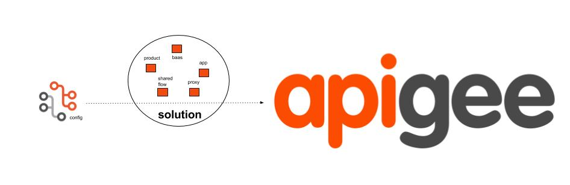

# Edge-Launchpad


A deployment tool for apigee solutions. Helps orchestrating the deployement of any solution comprising of apps, products, developer, proxy, baas data etc

### Developer guide
https://docs.google.com/document/d/1g6cmrbcb4l9WwExcutZCQt9-7E9qSqdpPs8XPpZ-hno/edit?usp=sharing

### Usage

Usage: ```gulp < deploy / build / clean > [options]```

Options: 

    --resource <resource>                     Pick any resource defined in config file

    --subresource <subresource1,subresource2> Pick any subresources defined under respective resource in config file 

    --item <item1,item2>                      Pick any items defined in respective RESOURCE,SUBRESOURCE in config file

    --strict                                  Do not run dependent tasks. eg. deploy will not run clean and build if --strict flag is passed 

    --env test                                Choose which edge environment for deployment

    --config <path to config file>            Relative to execution directory


Additional parameters can be passed to deploy script to avoid prompt. see **eg2**

**eg1** : gulp deploy

**eg2** : gulp deploy --username gauthamvk@google.com --org bumblebee --env test --resource openbank_apis


## Sample config
[samples/configuration/config_one.yml](samples/configuration/config_one.yml)

refer openbank and healthapix repo for reference implementation - [openbank](https://github.com/apigee/openbank), [healthapix](https://github.com/apigee/flame/tree/master/src/gateway)

## Bootstrap

You can find the bootstrap code in bootstrap folder

- copy all the files in bootstrap folder to your project directory
- run ```npm install```
- run ```npm install --global gulp-cli```
- run ```gulp deploy```
- refer the [developer guide](https://docs.google.com/a/apigee.com/document/d/1ptxyDnFRnH4tKGZb2C1QJ2-Qnp8izvxKCi7vZOJbrSQ/edit?usp=sharing) to add more subresources to the yaml file to deploy your project artifacts
-------------------

### This is not an official Google project
